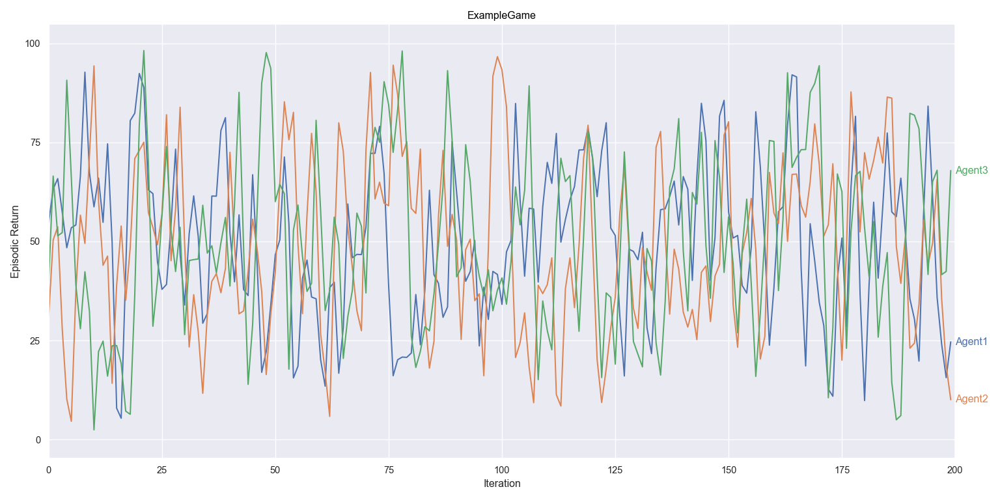
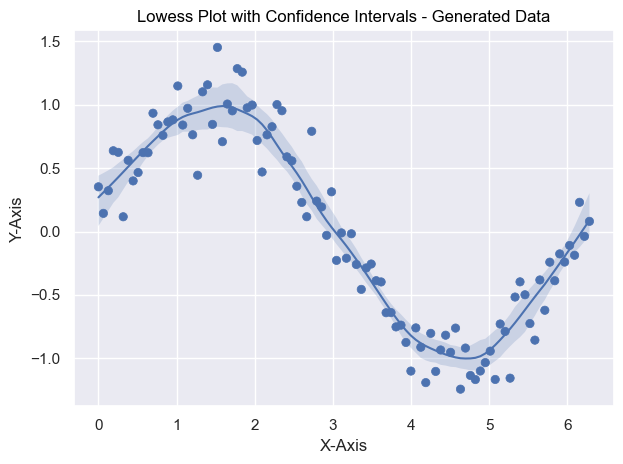
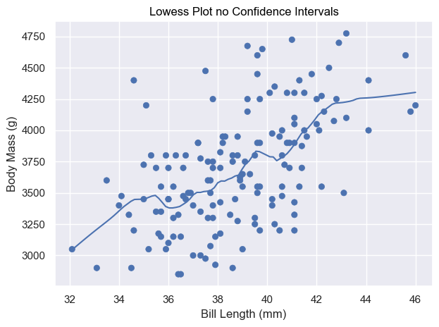
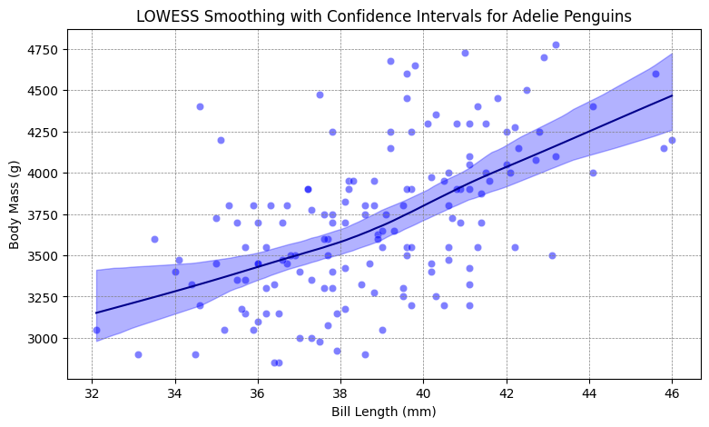
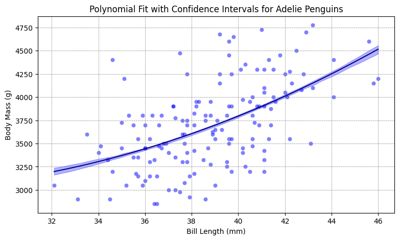

[][def]

# Seaborn Objects Recipes

## About

seaborn_objects_recipes is a Python package that extends the functionality of the Seaborn library, providing custom recipes for enhanced data visualization. This package includes below features to augment your Seaborn plots with additional capabilities.

- [Rolling](https://github.com/Ofosu-Osei/seaborn_objects_recipes/blob/main/seaborn_objects_recipes/recipes/rolling.py)
- [LineLabel](https://github.com/Ofosu-Osei/seaborn_objects_recipes/blob/main/seaborn_objects_recipes/recipes/line_label.py)
- [Lowess](https://github.com/Ofosu-Osei/seaborn_objects_recipes/blob/main/seaborn_objects_recipes/recipes/lowess.py)
- [PolyFitWithCI](https://github.com/Ofosu-Osei/seaborn_objects_recipes/blob/main/seaborn_objects_recipes/recipes/plotting.py)

## Installation

To install seaborn_objects_recipes, run the following command:

```python
pip install seaborn_objects_recipes

```

## Requirements

- Python 3.9 or higher
- Seaborn 0.13.0 or higher
- Statsmodels 0.14.1 or higher


## Usage

Please refer to the [testing file](https://github.com/Ofosu-Osei/seaborn_objects_recipes/blob/main/test_main.py) for a comprehensive overview of the testing process. The following sections illustrate the various functionalities available in the seaborn_objects_recipes package.

### Rolling & LineLabel

```python
import seaborn_objets_recipes as sor

def test_line_label(sample_data):
    game = "ExampleGame"
    fd_data = sample_data.query(f'`Game` == "{game}"')

    (
        fd_data.pipe(
            so.Plot, y="Episodic Return", x="Iteration", color="Agent", text="Agent"
        )
        .layout(size=(16, 8))
        .facet("Game")
        .limit(x=(0, 200))
        .scale(
            x=so.Continuous().tick(at=list(range(0, 201, 25))),
            y=so.Continuous().tick(upto=5).label(like="{x:,.0f}"),
        )
        .add(
            so.Lines(),
            so.Agg(),
            rolling := sor.Rolling(window_type="gaussian", window_kwargs={"std": 2}),
            legend=False,
        )
        
        .add(
            sor.LineLabel(offset=5),
            so.Agg(),
            rolling,
            legend=False,
        )
        .add(so.Band(), so.Est(errorbar="se"), legend=False)
        .show()
    )
```

### Output:




### Lowess with Generated Data

```python
import seaborn_objets_recipes as sor

def test_lowess_with_ci_gen():
    # Generate data for testing
    np.random.seed(0)
    x = np.linspace(0, 2 * np.pi, 100)
    y = np.sin(x) + np.random.normal(size=100) * 0.2
    data = pd.DataFrame({"x": x, "y": y})

    # Create the plot
    plot = (
        so.Plot(data, x="x", y="y")
        .add(so.Dot())
        .add(so.Line(), lowess := sor.Lowess(frac=0.2, gridsize=100, num_bootstrap=200, alpha=0.95))
        .add(so.Band(), lowess)
        .label(x="x-axis", y="y-axis", title="Lowess Plot with Confidence Intervals - Generated Data")
    )
    plt.show()
```

### Output



### Lowess with Penguins Dataset - No Booststrapping

```python
import seaborn_objets_recipes as sor

def test_lowess_with_no_ci(cleanup_files):
    # Load the penguins dataset
    penguins = sns.load_dataset("penguins")

    # Prepare data
    data = penguins[penguins['species'] == 'Adelie']

   # Create the plot
    plot = (
        so.Plot(data, x="bill_length_mm", y="body_mass_g")
        .add(so.Dot())
        .add(so.Line(), sor.Lowess())
        .label(x="Bill Length (mm)", y="Body Mass (g)", title="Lowess Plot no Confidence Intervals")
    )
    # Save Plot
    plt.savefig("lowess_nb.png")

    plt.show()
    
```

### Output



### Lowess with Penguins Dataset - Booststrapping

```python
import seaborn_objets_recipes as sor

def test_lowess_with_ci():
    # Load the penguins dataset
    penguins = sns.load_dataset("penguins")

    # Prepare data
    data = penguins[penguins['species'] == 'Adelie']

    # Create the plot
    plot = (
        so.Plot(data, x="bill_length_mm", y="body_mass_g")
        .add(so.Dot())
        .add(so.Line(), lowess := sor.Lowess(frac=0.2, gridsize=100, num_bootstrap=200, alpha=0.95))
        .add(so.Band(), lowess)
        .label(x="Bill Length (mm)", y="Body Mass (g)", title="Lowess Plot with Confidence Intervals")
    )
    plt.show()
    
```

### Output



### PolyFitWithCI
```python
def test_polyfit_with_ci(cleanup_files):
    # Load the penguins dataset
    penguins = sns.load_dataset("penguins")

    # Prepare data
    data = penguins.copy()
    data = data[data["species"] == "Adelie"]

    # Create the plot
    plot = (
        so.Plot(data, x="bill_length_mm", y="body_mass_g")
        .add(so.Dot())
        .add(so.Line(), PolyFitWithCI := sor.PolyFitWithCI(order=2, gridsize=100, alpha=0.05))
        .add(so.Band(), PolyFitWithCI)
        .label(x="Bill Length (mm)", y="Body Mass (g)", title="PolyFit Plot with Confidence Intervals")
    )
    plt.show()
```
### Output




## Contact

For questions or feedback regarding `seaborn_objects_recipes`, please contact [Ofosu Osei](mailto:goofosuosei@gmail.com).

[def]: https://github.com/Ofosu-Osei/seaborn_objects_recipes/actions/workflows/actions.yml
