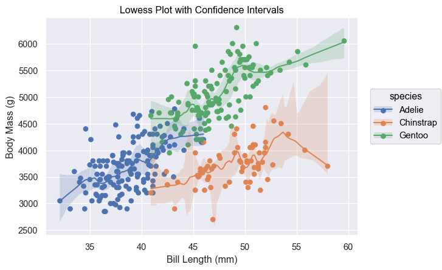

[][def]

# Seaborn Objects Recipes

## About

seaborn_objects_recipes is a Python package that extends the functionality of the Seaborn library, providing custom recipes for enhanced data visualization. This package includes below features to augment your Seaborn plots with additional capabilities.

- [Rolling](https://github.com/Ofosu-Osei/seaborn_objects_recipes/blob/main/seaborn_objects_recipes/recipes/rolling.py)
- [LineLabel](https://github.com/Ofosu-Osei/seaborn_objects_recipes/blob/main/seaborn_objects_recipes/recipes/line_label.py)
- [Lowess](https://github.com/Ofosu-Osei/seaborn_objects_recipes/blob/main/seaborn_objects_recipes/recipes/lowess.py)
- [PolyFitCI](https://github.com/Ofosu-Osei/seaborn_objects_recipes/blob/main/seaborn_objects_recipes/recipes/plotting.py)

## Installation

To install seaborn_objects_recipes, run the following command:

```python
pip install seaborn_objects_recipes

```

## Requirements

- Python 3.9 or higher
- Seaborn 0.13.0 or higher
- Statsmodels 0.14.1 or higher


## Usage

Please refer to the [testing file](https://github.com/Ofosu-Osei/seaborn_objects_recipes/blob/main/test_main.py) for a comprehensive overview of the testing process. The following sections illustrate the various functionalities available in the seaborn_objects_recipes package.

### Rolling & LineLabel

```python
import seaborn_objets_recipes as sor

def test_line_label(sample_data, cleanup_files):
    game = "ExampleGame"
    fd_data = sample_data.query(f'`Game` == "{game}"')

    (
        fd_data.pipe(
            so.Plot, y="Episodic Return", x="Iteration", color="Agent", text="Agent"
        )
        .layout(size=(16, 8))
        .facet("Game")
        .limit(x=(0, 200))
        .scale(
            x=so.Continuous().tick(at=list(range(0, 201, 25))),
            y=so.Continuous().tick(upto=5).label(like="{x:,.0f}"),
        )
        .add(
            so.Lines(),
            so.Agg(),
            sor.Rolling(window_type="gaussian", window_kwargs={"std": 2}),
            legend=False,
        )
        # This will be much easier when compound marks are implemented.
        # Will be able to do so.Line() + LineLabel().
        .add(
            sor.LineLabel(offset=5),
            so.Agg(),
            sor.Rolling(window_type="gaussian", window_kwargs={"std": 2}),
            legend=False,
        )
        .add(so.Band(), so.Est(errorbar="se"), legend=False)
        .show()
    )
```

### Output:


### Lowess with Generated Data

```python
import seaborn_objets_recipes as sor

def test_lowess():
    # Generate data for testing
    np.random.seed(0)
    x = np.linspace(0, 2 * np.pi, 100)
    y = np.sin(x) + np.random.normal(size=100) * 0.2
    data = pd.DataFrame({"x": x, "y": y})

    # Initialize LOWESS instance
    lowess = sor.Lowess(frac=0.4)
    # Call the LOWESS method on prepared data
    results = lowess(data)

    fig, ax = plt.subplots(figsize=(9, 5))

    # Scatter plot of the raw data
    sns.scatterplot(x="x", y="y", data=data, ax=ax, color="blue", alpha=0.5)

    # LOWESS smoothed line
    ax.plot(results["x"], results["y"], color="darkblue")

    # Confidence interval shading
    ax.fill_between(
        results["x"], results["ci_lower"], results["ci_upper"], color="blue", alpha=0.3
    )

    # Customizing plot
    ax.set_xlabel("x-axis")
    ax.set_ylabel("y-axis")
    ax.set_title("LOWESS Smoothing with Confidence Intervals for Generated Data")

    # Add gridlines
    ax.grid(True, which="both", color="gray", linewidth=0.5, linestyle="--")
    plt.show()
```

### Output


### Lowess with Penguins Dataset - No Booststrapping

```python
import seaborn_objets_recipes as sor

def test_lowess_with_no_ci():
    # Load the penguins dataset
    penguins = sns.load_dataset("penguins")

    # Prepare data
    data = penguins[penguins['species'] == 'Adelie']

    # Initialize LOWESS instance (no bootstrapping)
    lowess_no_bootstrap = sor.Lowess(frac=0.5, gridsize=100)

    # Call the LOWESS method on prepared data
    results_no_bootstrap = lowess_no_bootstrap(data, xvar ='bill_length_mm', yvar='body_mass_g')

    # Plotting
    fig, ax = plt.subplots(figsize=(9, 5))
    sns.scatterplot(x='bill_length_mm', y='body_mass_g', data=data, ax=ax, color='blue', alpha=0.5)
    ax.plot(results_no_bootstrap['bill_length_mm'], results_no_bootstrap['body_mass_g'], color='darkblue')
    ax.set_xlabel('Bill Length (mm)')
    ax.set_ylabel('Body Mass (g)')
    ax.set_title('LOWESS Smoothing for Adelie Penguins (No Bootstrapping)')
    ax.grid(True, which='both', color='gray', linewidth=0.5, linestyle='--')
    plt.show()
    
```

### Output


### Lowess with Penguins Dataset - Booststrapping

```python
import seaborn_objets_recipes as sor

def test_lowess_with_ci():
     # Load the penguins dataset
    penguins = sns.load_dataset("penguins")

    # Prepare data
    data = penguins[penguins['species'] == 'Adelie']

    # Initialize LOWESS instance with bootstrapping
    lowess_with_bootstrap = sor.Lowess(frac=0.9, gridsize=100, num_bootstrap=200, alpha=0.95)

    # Call the LOWESS method on prepared data
    results_with_bootstrap = lowess_with_bootstrap(data, xvar ='bill_length_mm', yvar='body_mass_g')

    # Plotting
    fig, ax = plt.subplots(figsize=(9, 5))
    sns.scatterplot(x='bill_length_mm', y='body_mass_g', data=data, ax=ax, color='blue', alpha=0.5)
    ax.plot(results_with_bootstrap['bill_length_mm'], results_with_bootstrap['body_mass_g'], color='darkblue')
    ax.fill_between(results_with_bootstrap['bill_length_mm'], 
                    results_with_bootstrap['ci_lower'], 
                    results_with_bootstrap['ci_upper'], 
                    color='blue', 
                    alpha=0.3
    )
    ax.set_xlabel('Bill Length (mm)')
    ax.set_ylabel('Body Mass (g)')
    ax.set_title('LOWESS Smoothing with Confidence Intervals for Adelie Penguins')
    ax.grid(True, which='both', color='gray', linewidth=0.5, linestyle='--')
    plt.show()
    
```

### Output


### PolyFitCI

```python
import seaborn_objets_recipes as sor

def test_regression_with_ci(cleanup_files):
    # Load the penguins dataset
    penguins = sns.load_dataset("penguins")

    # Create an instance of the class
    regression_plot = sor.PolyFitCI(order=2, gridsize=100, alpha=0.05)

    plot = regression_plot.plot(
        penguins[penguins.species == "Adelie"], xvar="bill_length_mm", yvar="body_mass_g"
    )

    plot = (
        plot
        .add(so.Dots(), y="body_mass_g")
        .label(x="Bill Length (mm)", y="Body Mass (g)")
    )
    
    plot.save("reg_with_ci.png")
    
```
### Output


## Contact

For questions or feedback regarding `seaborn_objects_recipes`, please contact [Ofosu Osei](mailto:goofosuosei@gmail.com).

[def]: https://github.com/Ofosu-Osei/seaborn_objects_recipes/actions/workflows/actions.yml
