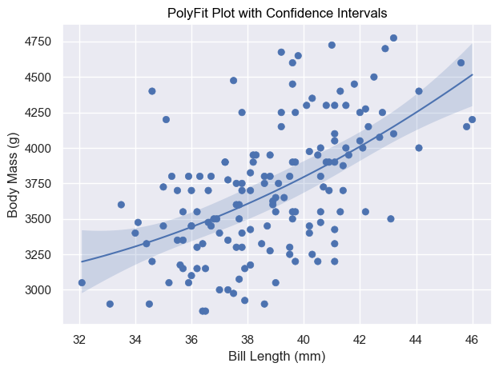

[][def]

# Seaborn Objects Recipes

## About

seaborn_objects_recipes is a Python package that extends the functionality of the Seaborn library, providing custom recipes for enhanced data visualization. This package includes below features to augment your Seaborn plots with additional capabilities.

- [Rolling](https://github.com/Ofosu-Osei/seaborn_objects_recipes/blob/main/seaborn_objects_recipes/recipes/rolling.py)
- [LineLabel](https://github.com/Ofosu-Osei/seaborn_objects_recipes/blob/main/seaborn_objects_recipes/recipes/line_label.py)
- [Lowess](https://github.com/Ofosu-Osei/seaborn_objects_recipes/blob/main/seaborn_objects_recipes/recipes/lowess.py)
- [PolyFitWithCI](https://github.com/Ofosu-Osei/seaborn_objects_recipes/blob/main/seaborn_objects_recipes/recipes/plotting.py)

## Installation

To install `seaborn_objects_recipes`, run the following command:

```python
pip install seaborn_objects_recipes

```

## Requirements

- Python 3.9 or higher
- Seaborn 0.13.0 or higher
- Statsmodels 0.14.1 or higher


## Overview of the Custom Recipes

1. **Rolling:** This class provides a method to apply rolling window operations on data, enabling smooth and flexible aggregations such as moving averages.

2. **LineLabel:** This class facilitates the addition of labels to lines in your plots, improving readability and providing additional context directly on the graph.

3. **Lowess:** The Locally Weighted Scatterplot Smoothing (LOWESS) class allows for the fitting of smooth curves to data using local regression, which is particularly useful for visualizing trends in noisy datasets. It also includes options to compute confidence intervals using bootstrapping.

4. **PolyFitWithCI:** This class fits polynomial curves to your data and includes functionality to calculate and visualize confidence intervals, providing a robust method for polynomial regression analysis.

## Usage Examples

### Rolling Averages and Line Labels

In this example, we will generate a simulated dataset and create a plot that demonstrates the use of rolling averages and line labels. The dataset simulates the performance of three agents over multiple iterations in a game. We will use the `Rolling` and `LineLabel` classes from the `seaborn_objects_recipes` package to enhance the visualization.

```python
import seaborn.objects as so
import seaborn_objets_recipes as sor
import pandas as pd
import numpy as np
```

### Generating Simulated Data
First, we define a function `sample_data()` to generate a DataFrame with simulated data. The data includes the episodic returns of three agents over 200 iterations in a game called "ExampleGame".

```Python
def sample_data():
    # Parameters for simulation
    game = "ExampleGame"
    agents = ["Agent1", "Agent2", "Agent3"]
    num_iterations = 200
    num_agents = len(agents)

    # Create a simulated DataFrame
    np.random.seed(0)  # For reproducible results
    data = {
        "Game": [game] * num_iterations * num_agents,
        "Episodic Return": np.random.rand(num_iterations * num_agents) * 100,
        "Iteration": list(range(num_iterations)) * num_agents,
        "Agent": np.repeat(agents, num_iterations),
    }

    return pd.DataFrame(data)
```

### Creating the Plot
Next, we use the seaborn.objects interface to create a plot that includes rolling averages and line labels. We utilize the `Rolling` class to apply a Gaussian rolling average and the `LineLabel` class to add informative labels to the lines.

```python
def test_line_label():
    data = sample_data()

    (
        data.pipe(
            so.Plot, y="Episodic Return", x="Iteration", color="Agent", text="Agent"
        )
        .layout(size=(16, 8))
        .facet("Game")
        .limit(x=(0, 200))
        .scale(
            x=so.Continuous().tick(at=list(range(0, 201, 25))),
            y=so.Continuous().tick(upto=5).label(like="{x:,.0f}"),
        )
        .add(
            so.Lines(),
            so.Agg(),
            rolling := sor.Rolling(window_type="gaussian", window_kwargs={"std": 2}),
            legend=False,
        )
        
        .add(
            sor.LineLabel(offset=5),
            so.Agg(),
            rolling,
            legend=False,
        )
        # Display Plot
        .show()
    )
```

### Output:


### Lowess

The `Lowess` recipe in the `seaborn_objects_recipes` package provides a method for locally-weighted regression, also known as LOWESS. This technique is useful for smoothing data and visualizing trends in a dataset. LOWESS is particularly effective for non-linear data and helps in identifying patterns without assuming a specific functional form.

**Key Features:**

* **Locally-Weighted Regression:** Fit a smooth curve to your data using a local regression technique.
* **Customizable Smoothing:** Control the fraction of data points used for each local regression to adjust the smoothness of the curve.
* **Confidence Intervals:** Optionally compute bootstrap confidence intervals to visualize the uncertainty in the smoothed curve.

**Parameters:**

* **frac:** The fraction of data used when estimating each y-value. A smaller value results in more local smoothing.
* **gridsize:** The number of points in the grid to which the LOWESS is applied. Higher values result in a smoother curve.
* **delta:** Distance within which to use linear interpolation instead of weighted regression.
* **num_bootstrap:** The number of bootstrap samples to use for computing confidence intervals.
* **alpha:** The confidence level for the intervals.

### Lowess with Generated Data

```python
import seaborn.objects as so
import seaborn_objects_recipes as sor
import pandas as pd
import numpy as np

def test_lowess_with_ci_gen():
    # Generate data for testing
    np.random.seed(0)
    x = np.linspace(0, 2 * np.pi, 100)
    y = np.sin(x) + np.random.normal(size=100) * 0.2
    data = pd.DataFrame({"x": x, "y": y})

    # Create the plot
    plot = (
        so.Plot(data, x="x", y="y")
        .add(so.Dot())
        .add(so.Line(), lowess := sor.Lowess(frac=0.2, gridsize=100, num_bootstrap=200, alpha=0.95))
        .add(so.Band(), lowess)
        .label(x="x-axis", y="y-axis", title="Lowess Plot with Confidence Intervals - Generated Data")
    )
    # Display Plot
    plot.show()
```

### Output


### Lowess with Penguins Dataset - No Booststrapping

```python
import seaborn.objects as so
import seaborn as sns
import seaborn_objects_recipes as sor

def test_lowess_with_no_ci():
    # Load the penguins dataset
    penguins = sns.load_dataset("penguins")

    # Prepare data
    data = penguins.copy()
    data = penguins[penguins['species'] == 'Adelie']

   # Create the plot
    plot = (
        so.Plot(data, x="bill_length_mm", y="body_mass_g")
        .add(so.Dot())
        .add(so.Line(), sor.Lowess())
        .label(x="Bill Length (mm)", y="Body Mass (g)", title="Lowess Plot no Confidence Intervals")
    )
    # Display Plot
    plot.show()
    
```

### Output


### Lowess with Penguins Dataset - Booststrapping

```python
import seaborn.objects as so
import seaborn as sns
import seaborn_objects_recipes as sor

def test_lowess_with_ci():
    
    # Load the penguins dataset
    penguins = sns.load_dataset("penguins")

    # Prepare data
    data = penguins.copy()
    data = penguins[penguins['species'] == 'Adelie']

    # Create the plot
    plot = (
        so.Plot(data, x="bill_length_mm", y="body_mass_g")
        .add(so.Dot())
        .add(so.Line(), lowess := sor.Lowess(frac=0.2, gridsize=100, num_bootstrap=200, alpha=0.95))
        .add(so.Band(), lowess)
        .label(x="Bill Length (mm)", y="Body Mass (g)", title="Lowess Plot with Confidence Intervals")
    )
    # Display Plot
    plot.show()
    
```

### Output


### PolyFitWithCI
The `PolyFitWithCI` recipe in the `seaborn_objects_recipes` package provides a method for fitting polynomial regression models to data, including confidence intervals. Polynomial regression is useful for capturing non-linear relationships between variables, and adding confidence intervals helps visualize the uncertainty around the fitted polynomial curve.

**Key Features:**
* **Polynomial Regression:** Fit a polynomial of a specified order to your data.
* **Customizable Order:** Control the order of the polynomial to capture different degrees of non-linearity.
* **Confidence Intervals:** Compute and visualize confidence intervals around the fitted polynomial curve.

**Parameters:**
* **order:** The order of the polynomial to fit. Higher orders can capture more complex relationships but may overfit the data.
* **gridsize:** The number of points in the grid to which the polynomial is applied. Higher values result in a smoother curve.
* **alpha:** The confidence level for the intervals.


```python
import seaborn.objects as so
import seaborn as sns
import seaborn_objects_recipes as sor

def test_polyfit_with_ci():
    
    # Load the penguins dataset
    penguins = sns.load_dataset("penguins")

    # Prepare data
    data = penguins.copy()
    data = data[data["species"] == "Adelie"]

    # Create the plot
    plot = (
        so.Plot(data, x="bill_length_mm", y="body_mass_g")
        .add(so.Dot())
        .add(so.Line(), PolyFitWithCI := sor.PolyFitWithCI(order=2, gridsize=100, alpha=0.05))
        .add(so.Band(), PolyFitWithCI)
        .label(x="Bill Length (mm)", y="Body Mass (g)", title="PolyFit Plot with Confidence Intervals")
    )
    # Display Plot
    plot.show()
```
### Output



## Contributing

Contributions are welcome! Please feel free to submit a Pull Request.

## Contact

For questions or feedback regarding `seaborn_objects_recipes`, please contact [Ofosu Osei](mailto:goofosuosei@gmail.com).

[def]: https://github.com/Ofosu-Osei/seaborn_objects_recipes/actions/workflows/actions.yml

## Credits

* Special thanks to [@JesseFarebro](https://github.com/JesseFarebro) for [Rolling, LineLabel](https://github.com/mwaskom/seaborn/discussions/3133)

* Special thanks to [@tbpassin](https://github.com/tbpassin) and [@kcarnold](https://github.com/kcarnold) for [LOWESS Smoother](https://github.com/mwaskom/seaborn/issues/3320)
