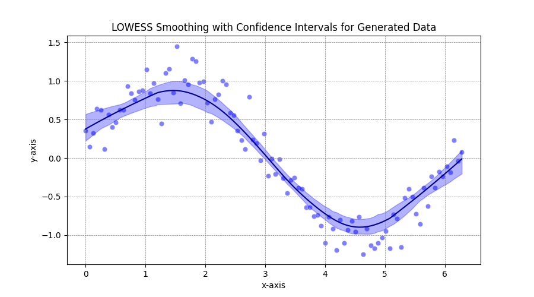

[][def]

# Seaborn Objects Recipes

## About

seaborn_objects_recipes is a Python package that extends the functionality of the Seaborn library, providing custom recipes for enhanced data visualization. This package includes below features to augment your Seaborn plots with additional capabilities.

- [Rolling](https://github.com/Ofosu-Osei/seaborn_objects_recipes/blob/main/seaborn_objects_recipes/recipes/rolling.py)
- [LineLabel](https://github.com/Ofosu-Osei/seaborn_objects_recipes/blob/main/seaborn_objects_recipes/recipes/line_label.py)
- [Lowess](https://github.com/Ofosu-Osei/seaborn_objects_recipes/blob/main/seaborn_objects_recipes/recipes/lowess.py)

## Installation

To install seaborn_objects_recipes, run the following command:

```python
pip install seaborn_objects_recipes

```

## Requirements

Python 3.9 or higher
Seaborn 0.12.0 or higher
Matplotlib
Pandas
Statsmodels
Scipy

## Usage

Refer to the example [test_file](https://github.com/Ofosu-Osei/seaborn_objects_recipes/blob/main/test_main.py). Below are examples of how you can use the different functionalities provided by seaborn_objects_recipes.

### Rolling

```python
import seaborn_objets_recipes as sor

sor.Rolling(window_type="gaussian", window_kwargs={"std": 2})
```

### LineLabel

```python
import seaborn_objets_recipes as sor

sor.LineLabel(offset=5)
```

### Lowess

```python
import seaborn_objets_recipes as sor

sor.Lowess()
```

## Example Output

### Rollig and LineLabel in action:


### Lowess in action



## Contact

For questions or feedback regarding `seaborn_objects_recipes`, please contact [Ofosu Osei](mailto:goofosuosei@gmail.com).

[def]: https://github.com/Ofosu-Osei/seaborn_objects_recipes/actions/workflows/actions.yml
